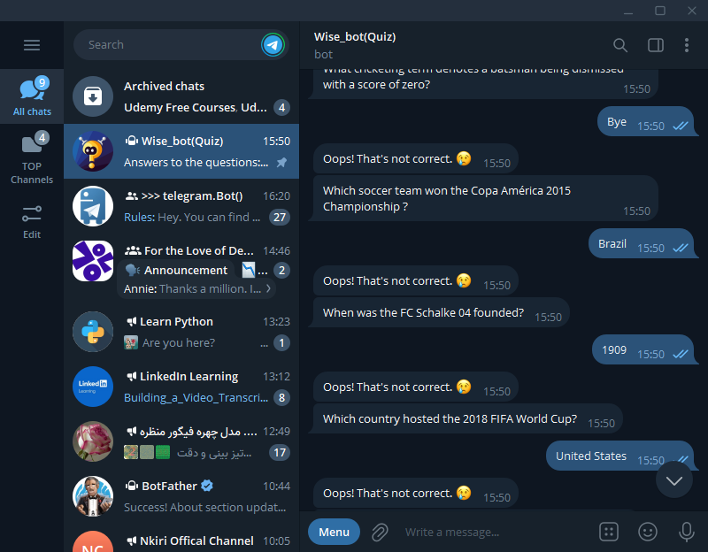

## Wise_Bot: Your Interactive Trivia Companion

Welcome to Wise_Bot, the ultimate interactive trivia experience right at your fingertips. Built with the power of Python and the Telegram Bot API, Wise_Bot offers a wide range of categories for endless fun and learning. Whether you're looking to test your general knowledge, challenge your friends, or just kill some time, Wise_Bot is here to keep you entertained.

# Features

- Multiple Quiz Categories: Choose from a variety of categories to test your knowledge.
- Dynamic Question Pool: With a vast database of questions, you'll rarely see the same question twice.
- Score Tracking: Keep track of your correct answers and see how well you perform.
- User-Friendly Interface: Simple and intuitive, designed for seamless interaction.

# Getting Started

> Prerequisites
Before you can run Wise_Bot on your local machine, make sure you have the following installed:

- Python 3.6 or higher
- pip (Python package manager)

# Installation

1. Clone the repository to your local machine:
```git clone https://github.com/yourusername/Wise_Bot.git
cd Wise_Bot```

2. Install the required Python packages:
`pip install -r requirements.txt`

3. Create a .env file in the root directory of the project and add your Telegram Bot Token:
`TELEGRAM_API_TOKEN=your_telegram_bot_token_here`
If you dont already have a bot key or bot, go through this article --> https://core.telegram.org/bots#how-do-i-create-a-bot

4. Running the Bot
To start Wise_Bot, run the following command in your terminal:

`python basemodel.py`

Now, you can interact with your bot on Telegram by starting a conversation with it.

# How to Use

Start a conversation with Wise_Bot on Telegram.
Use the /start command to begin your quiz journey.
Select a category from the provided list.
Answer the questions to the best of your ability. Good luck!



# Contributing

Contributions are what make the open-source community such an amazing place to learn, inspire, and create. Any contributions you make are greatly appreciated.

If you have a suggestion that would make this better, please fork the repo and create a pull request. You can also simply open an issue with the tag "enhancement".

Don't forget to give the project a star! Thanks again!


# Fork the Project

Create your Feature Branch (git checkout -b feature/AmazingFeature)
Commit your Changes (git commit -m 'Add some AmazingFeature')
Push to the Branch (git push origin feature/AmazingFeature)
Open a Pull Request

# License
Distributed under the MIT License. See LICENSE for more information.

Contact
Your Name - [Wiseman Umanah](https://www.twitter.com/wisemanjoearts)

Project Link: https://github.com/wiseman-umanah/Wise_Bot.git

